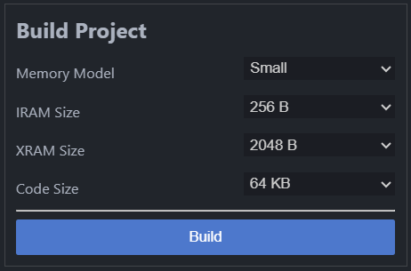
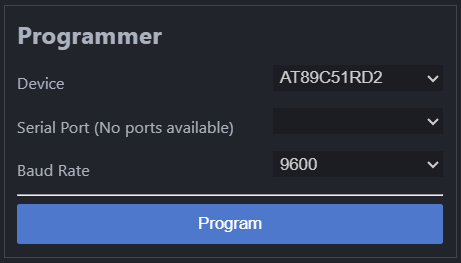
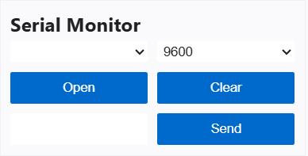

<!-- Google tag (gtag.js) -->

| [Home](index.md) | [Features](features.md) | [Changelog](changelog.md) | [Privacy Policy](privacyPolicy.md) |

## Features

### Build Menu

Compile your 8051 projects using this simple integrated build menu. Designed specifically so that you do not have to struggle to change any of your project settings. Beginner friendly but gives you all the power you need. 

### Program Menu

Program/Flash your AT89LP devices with a powerful built-in programmer. Easily change your targeted device, serial port and Baud rate with the dropdown menus.

### Serial Monitor

Debug your serial communications directly inside VS Code using the built-in serial monitor. Choose your serial port and baud rate with ease. Send and receive serial data using the integrated serial monitor, without installing any external dependencies.

---

---

**© 2026 Philip. All rights reserved.**

AT89LP is proprietary software. The free version is available through the
Visual Studio Code Marketplace. Premium features are available separately.

AT89LP is an independent project and is not affiliated with or endorsed by
Microsoft Corporation or Microchip Technology Inc.